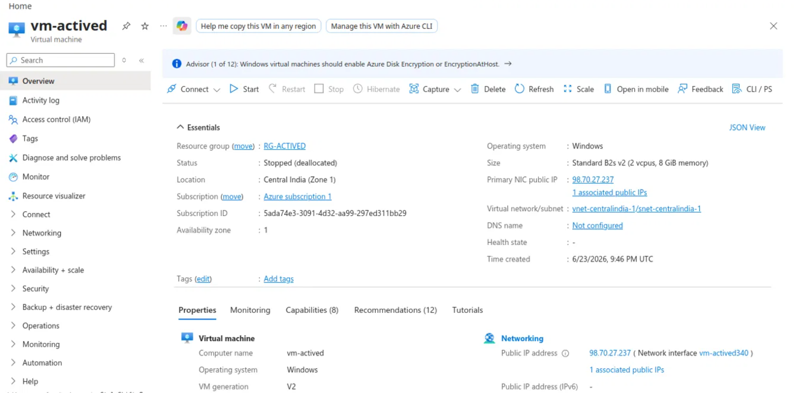
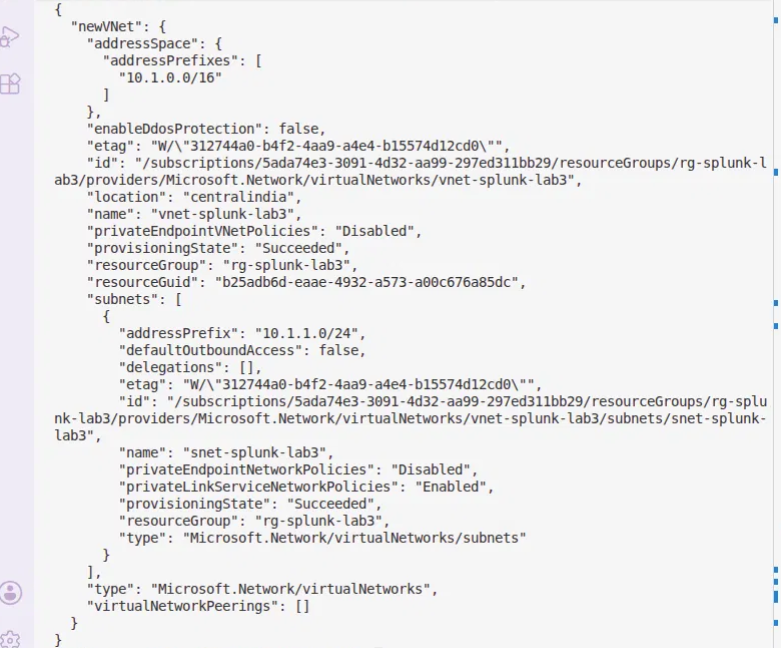
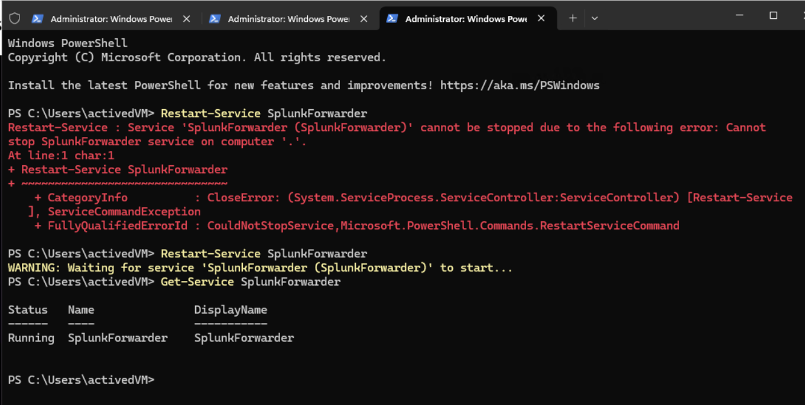
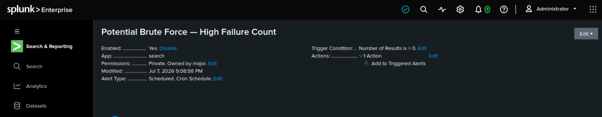

# 03 Splunk SIEM & Log Analysis

**Splunk Enterprise · Azure VMs · VNet Peering · SOC Detection Skills**

---

## [▶️ Lab Walkthrough Video](https://www.loom.com)

## What This Lab Covers

Splunk Enterprise is a platform for collecting, indexing, and searching machine data, including logs from servers, network devices, applications, and security tools, enabling correlation and analysis across large volumes of log data.

In this lab, I deployed a Splunk Enterprise instance on an Ubuntu 22.04 virtual machine in Microsoft Azure, peered via VNet Peering with an existing Windows Server VM. From there, I configured log ingestion, built searches to correlate events, and created alerts to detect specific activity patterns.

---

## Architecture

This deployment connects **two separately-built Azure VMs** — a Windows Server VM from an earlier lab, and a new Ubuntu VM running Splunk — using **VNet peering**. 

```
┌─────────────────────────────┐         ┌──────────────────────────────┐
│  vnet-centralindia-1         │         │  vnet-splunk-lab3             │
│  (10.0.0.0/16)                │◄──────►│  (10.1.0.0/16)                │
│                               │ Peered │                                │
│  ┌─────────────────────────┐ │         │  ┌──────────────────────────┐ │
│  │ vm-actived               │ │         │  │ splunk-vm                 │ │
│  │ Windows Server           │ │         │  │ Ubuntu 22.04               │ │
│  │ Universal Forwarder      │─┼─────────┼─►│ Splunk Enterprise 10.4.1   │ │
│  │ generates Security /     │ │ :9997  │  │ receives + indexes logs    │ │
│  │ System / Application logs│ │         │  │ web UI on :8000            │ │
│  └─────────────────────────┘ │         │  └──────────────────────────┘ │
└─────────────────────────────┘         └──────────────────────────────┘
        NSG: RDP (3389)                          NSG: SSH (22), Web UI (8000)
                                                   — locked to admin's IP
                                                  Forwarder (9997) — VNet-only
```

Both VMs' Network Security Groups restrict access by source IP or VNet range — SSH and the Splunk web UI are reachable only from the admin's own IP; the forwarder port (9997) accepts traffic only from the two peered VNet ranges, never the public internet.

---

## Key Concepts

**SIEM (Security Information and Event Management):** a platform that collects log data from across an environment and makes it searchable in one place. Its two core jobs are **correlation** (connecting events across systems to reveal patterns) and **alerting** (notifying analysts automatically when suspicious conditions are met).

**SPL (Splunk Processing Language):** the pipeline-based query language used to search Splunk. Example: `index=windows_logs EventCode=4625 | stats count by Account_Name | sort -count` finds failed logins, counts them by username, sorts highest to lowest.

**VNet Peering:** a private connection between two otherwise-isolated Azure Virtual Networks, letting VMs in each reach the other's private IPs directly without routing through the public internet. Used here to connect the pre-existing Windows Server VM's network to a newly-built Splunk network.

**Windows Event IDs used throughout this lab:**
- **4624** — successful logon
- **4625** — failed logon attempt
- **4740** — account lockout

---

## What I Built

1. Deployed a new Ubuntu VM running Splunk Enterprise in its own Virtual Network
2. Peered that VNet (bidirectionally) with the existing Windows Server VM's VNet from an earlier lab
3. Locked down Network Security Group rules by source IP/VNet range rather than leaving ports open to the internet
4. Installed and configured the Splunk Universal Forwarder on the Windows Server VM to ship Security/System/Application event logs to Splunk over the peered network
5. Built SPL searches covering failed logins, successful logins, account lockouts, top failed usernames, and after-hours login activity
6. Built a 4-panel security dashboard (Windows Security Overview) and a scheduled automated brute-force detection alert

---

## Screenshots

**1. Confirming the existing Windows Server VM (from a prior lab) before connecting to it**


**2. Creating a dedicated VNet for the new Splunk VM**


**3. Verifying VNet peering is active in both directions**


**4. Deploying the Splunk VM into the peered network**


**5. Confirming both VMs running before proceeding**


**6. Downloading Splunk Enterprise directly onto the VM via SSH**


**7. Installing Splunk and setting admin credentials**


**8. Updated forwarder configuration to point at the current Splunk VM's private IP**


**9. Universal Forwarder service running**


**10. Verification — logs flowing into Splunk end-to-end (peering → forwarder → indexing)**


**11. EventCode=4625 search identifying brute-force login attempts against the Windows VM**


**12. Windows Security Overview dashboard — Failed Logins & Account Lockouts panels**


**13. Windows Security Overview dashboard — Login Activity Over Time & Top Source IPs panels**


**14. Automated brute-force alert — configured and saved**


---

## Verification Checklist

| Check | Result |
|---|---|
| VNet peering connected (both directions) | ✅ Confirmed via `az network vnet peering list` |
| Both VMs running | ✅ `splunk-vm` and `vm-actived` both `VM running` |
| Splunk service running | ✅ `splunkd is running` |
| Universal Forwarder running | ✅ `SplunkForwarder` service `Running` |
| Data flowing into Splunk | ✅ 100+ events returned from `windows_logs` index |
| Failed login detection working | ✅ 4,500+ real-world EventCode 4625 events identified |
| No unauthorized access occurred | ✅ Only 2 legitimate EventCode 4624 / Logon_Type=10 sessions found |
| Account lockouts | ✅ Zero — confirms broad/shallow attack pattern, not targeted |
| Security dashboard built | ✅ Windows Security Overview — all 4 panels functioning |
| Automated alert active | ✅ "Potential Brute Force — High Failure Count" — Enabled, runs every 15 min |
| RDP exposure remediated | ✅ NSG rule restricted to single trusted IP |

---

